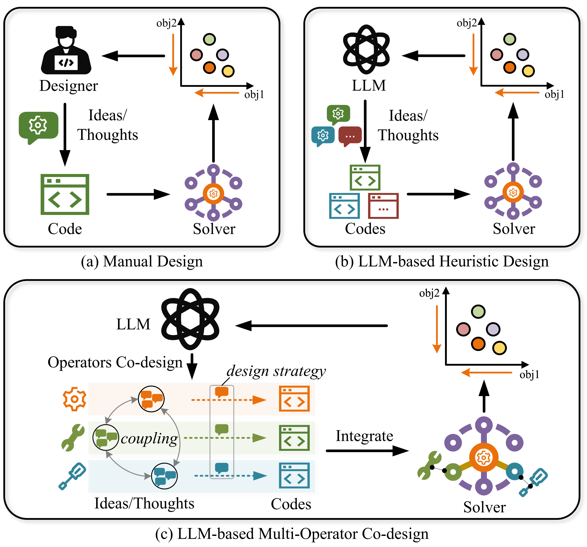
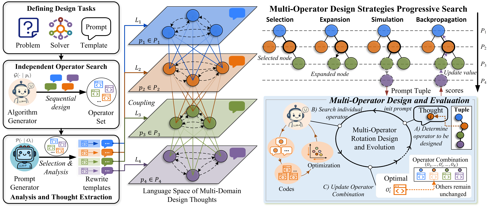

# E2OC: Evolving Interdependent Operators with Large Language Models for Multi-Objective Combinatorial Optimization

[]()
[](https://opensource.org/licenses/MIT)
[]()
[](https://arxiv.org/abs/2601.17899)

**E2OC** is the first framework for multi-operator co-design in MOEAs. It leverages MDP to analyze cross-operator coupling relationships and jointly evolves operator design strategies with executable code via Monte Carlo Tree Search. Existing LLM-based AHD methods optimize each operator independently, ignoring a fundamental challenge: modifying one operator reshapes the search landscape for others. E2OC addresses this by co-evolving interdependent operators, and its modular architecture enables flexible extension with new components.

**Website**: [https://jhqiu1.github.io/e2oc](https://jhqiu1.github.io/e2oc)

---

## Introduction

### Design Paradigm



Multi-Objective Evolutionary Algorithms (MOEAs) rely on neighborhood search operators (crossover, mutation, local search) whose design is critical to performance. Three paradigms are compared:

1. **Expert Design** &mdash; Costly, domain-specific, hard to generalize
2. **Single-Operator AHD** (EoH, FunSearch, ReEvo, etc.) &mdash; Optimizes each operator in isolation, ignores cross-operator coupling effects
3. **E2OC (Ours)** &mdash; The first framework to co-evolve interdependent operators via MDP analysis and MCTS search

### E2OC Framework



E2OC consists of four core components:

**Warm-Start Initialization.** The algorithm generator $\mathcal{G}$ independently evolves each operator to build a structured **design thought space**, extracting semantic-level improvement suggestions from elite operators. This pre-constructs a curated set of high-quality design thoughts per operator, bounding the search from unbounded to tractable.

**Language Space of Multi-Domain Thoughts.** Operator design thoughts correspond to semantic-level representations, each defining a decision paradigm or improvement direction. Internal relationships characterize alternatives within the same operator, while external relationships denote cross-domain dependencies (complementary, conflicting, or mutually exclusive) between different operators. MDP is used to analyze these coupling relationships.

**Progressive MCTS Search.** Explore **combinations** of design thoughts across operators to identify promising design strategies. The design space is modeled as a tree where node states represent design thoughts in different domains. UCB-based selection balances exploration and exploitation. Counter-intuitively, the bounded space improves performance by concentrating the evaluation budget.

**Operator Rotation Evolution.** Under a chosen design strategy, each operator is evolved and evaluated **in context** within the actual multi-operator system. During rotation, operators are progressively updated by replacing individual operators and evaluating their impact on overall performance. The **algorithm generator is pluggable**, built on the [LLM4AD](https://github.com/Optima-CityU/LLM4AD) platform and supporting multiple methods including **EoH, FunSearch, ReEvo, and MCTS-AHD**.

### Design Philosophy

| Philosophy | Description |
|-----------|-------------|
| **Semantic-Level over Code-Level Search** | Search in design intent space, not syntax mutation space |
| **Bounded over Unbounded** | Curated thought sets improve sample efficiency |
| **Co-Design Yields Complementarity** | Evolved operators spontaneously develop functional division of labor |

### Key Results

| Benchmark | vs. Expert | vs. Best AHD (Single) | vs. Best AHD (Multi) |
|-----------|-----------|----------------------|---------------------|
| Bi-FJSP + NSGA-II | **+22.00% HV** | +7.3% | +12.2% |
| Bi-TSP + NSGA-II | **+14.00% HV** | | |
| Tri-FJSP + NSGA-II | **+17.36% HV** | | |

**Cost**: ~$1.14 per design task (DeepSeek-Chat). **Generalization**: operators trained on TSP-100 transfer to TSP-200 with +22.06% HV gain.


E2OC sustains **continuous optimization**: Round 1 &rarr; Round 2 (+0.8% HV) &rarr; Round 3 (+1.6% HV) without convergence traps. Operators generalize across problem scales (TSP-100 &rarr; TSP-150/200).

---

## Requirements

- Python >= 3.9
- `numpy < 2.0.0`, `scipy`, `torch`, `networkx`
- `requests`, `openai` (for LLM API calls)
- `hvwfg >= 1.0.0` (for hypervolume calculation)
- Optional: `tensorboard`, `wandb`, `matplotlib`, `codebleu`

The MOEA engine is implemented in pure Python and included in the repository. No external MOEA framework installation is needed.

---

## Quick Start

### Installation

```bash
cd E2OC

# Option 1: Install from requirements.txt
pip install -r requirements.txt

# Option 2: Install as editable package (recommended for development)
pip install -e .
```

The project uses `pyproject.toml` as the modern Python build configuration.

### Step 1: Configure LLM API

Edit [`examples/tsp_biobjective/config.py`](examples/tsp_biobjective/config.py):

```python
LLM_CONFIG = {
    "host": "api.deepseek.com",      # Your LLM API host
    "api_key": "your_api_key_here",  # Your LLM API key
    "model": "deepseek-chat",         # Your LLM model
    "timeout": 120,
}
```

### Step 2: Run E2OC

```bash
python run_e2oc.py
```

The framework will execute the four-component co-evolution process:
1. **Warm-Start**: Initialize operator populations via independent evolution
2. **Language Space**: Build multi-domain design thought space
3. **Progressive MCTS Search**: Explore design strategy combinations
4. **Operator Rotation Evolution**: Co-evolve operators in context

Results are saved to `outputs_tsp/`.

### Step 3: Check Results

| File | Content |
|------|---------|
| `storages.json` | Operator performance history |
| `best_results_*.json` | Best operators found |
| `mcts_history.txt` | MCTS search history |
| `convergence_curve.jpg` | Convergence plot |

---

## Use E2OC in Your Application

*Coming soon:* A dedicated guide for adapting E2OC to new multi-objective optimization problems and using individual generators (EoH, FunSearch, etc.) independently.

---

## Citation

If you find E2OC helpful for your research or applied projects, please cite:

```bibtex
@inproceedings{qiu2026e2oc,
  title={Evolving Interdependent Operators with Large Language Models for Multi-Objective Combinatorial Optimization},
  author={Qiu, Junhao and Chen, Xin and Ge, Liang and Lin, Liyong and Lu, Zhichao and Zhang, Qingfu},
  booktitle={International Conference on Machine Learning (ICML)},
  year={2026},
  url={https://arxiv.org/abs/2601.17899}
}
```

If you are interested in LLM4Opt or E2OC, you can:

- Contact us through email: junhaoqiu2-c@my.cityu.edu.hk
- Visit a collection of references and research papers on LLM4Opt
- Join our Group (coming soon)

If you encounter any difficulty using the code, please contact us through the above or submit an issue.

---

## License

This project is licensed under the MIT License. See [LICENSE](LICENSE) for details.
