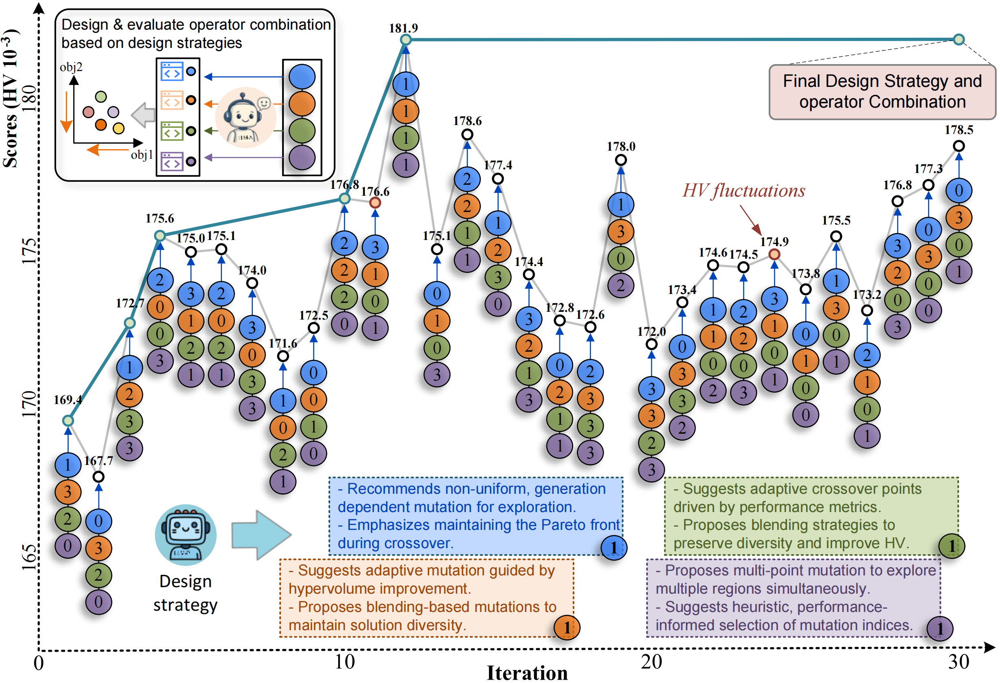

# E2OC: Evolving Interdependent Operators with LLMs for Multi-Objective Combinatorial Optimization

**Accepted at ICML 2026**

> Junhao Qiu, Xin Chen, Liang Ge, Liyong Lin, Zhichao Lu, Qingfu Zhang

Paper: [arXiv:2601.17899](https://arxiv.org/abs/2601.17899) | Code: [github.com/jhqiu1/E2OC](https://github.com/jhqiu1/E2OC)

---

## Core Idea

Multi-Objective Evolutionary Algorithms (MOEAs) rely on **neighborhood search operators** (crossover, mutation, local search) whose design is critical to performance. Existing LLM-based Automated Heuristic Design (AHD) methods optimize each operator **independently**, ignoring cross-operator coupling effects — modifying one operator reshapes the search landscape for others.

**E2OC** formulates multi-operator co-evolution as a **Markov Decision Process (MDP)**, enabling **co-evolution** of operator design strategies and executable code via Monte Carlo Tree Search.

---

## Design Paradigm

Three paradigms compared:
1. **Expert Design** — costly, domain-specific, hard to generalize
2. **Single-Operator AHD** (EoH, FunSearch, ReEvo, etc.) — optimizes each operator in isolation, ignores coupling
3. **E2OC (Ours)** — co-evolves interdependent operators via MDP-guided MCTS search

---

## Framework

**Phase 1: Warm-Start.** Build a structured **design thought space** — extract semantic-level improvement suggestions from independently evolved elite operators. This pre-constructs a curated set of high-quality design thoughts per operator, bounding the search from unbounded to tractable.

**Phase 2: Progressive MCTS Search.** Explore **combinations** of design thoughts across operators to identify promising design strategies. UCB-based selection balances exploration and exploitation. Counter-intuitively, the bounded space improves performance by concentrating the evaluation budget.

**Phase 3: Operator Rotation Evolution.** Under a chosen design strategy, each operator is evolved and evaluated **in context** within the actual multi-operator system. The algorithm generator is **pluggable**, supporting EoH, FunSearch, MCTS-AHD, ReEvo, etc.

---

## Key Results

| Benchmark | vs. Expert | vs. Best AHD (Single) | vs. Best AHD (Multi) |
|-----------|-----------|----------------------|---------------------|
| Bi-FJSP + NSGA-II | **+22.00% HV** | +7.3% | +12.2% |
| Bi-TSP + NSGA-II | **+14.00% HV** | — | — |
| Tri-FJSP + NSGA-II | **+17.36% HV** | — | — |

**Cost:** ~$1.14 per design task (DeepSeek-Chat). **Generalization:** operators trained on TSP-100 transfer to TSP-200 with +22.06% HV gain.

E2OC sustains **continuous optimization**: Round 1 → Round 2 (+0.8% HV) → Round 3 (+1.6% HV) without convergence traps. Operators generalize across problem scales (TSP-100 → TSP-150/200).

---

## Design Philosophy

- **Semantic-Level > Code-Level Search** — search in design intent space, not syntax mutation space
- **Bounded > Unbounded** — curated thought sets improve sample efficiency
- **Co-Design Yields Complementarity** — evolved operators spontaneously develop functional division of labor that cannot be achieved independently
